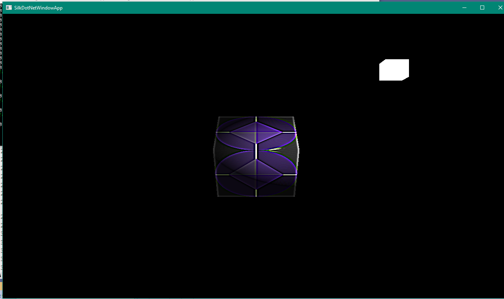
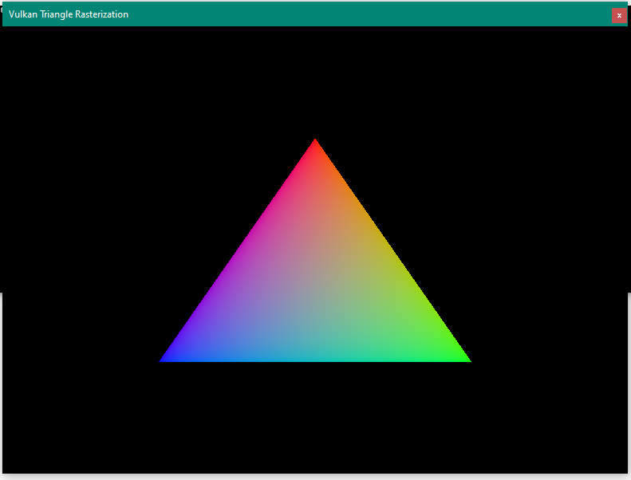

# Learnign-WinUI

This repository contains various projects and libraries related to game development, procedural generation, and graphics rendering.

## Main Projects and Libraries

- **CoreLibrary**: Includes services for ECS (Entity-Component-System) architecture.
  - `CoreLibrary/Services/EcsServiceExtension.cs`
  - `CoreLibrary/Services/Game.cs`
- **ProceduralGenerationLibrary**: Contains classes for hex grid and maze generation.
  - `ProceduralGenerationLibrary/HexGrid/HexCell.cs`
  - `ProceduralGenerationLibrary/Maze/Cell.cs`
- **SharedLibrary**: Provides shared components, event handlers, and transforms.
  - `SharedLibrary/Event/Handler/EventHandler.cs`
  - `SharedLibrary/Transforms/Transform.cs`

## Purpose and Goals

The purpose of this repository is to provide a collection of tools and libraries for game development, procedural generation, and graphics rendering. The goal is to create a modular and efficient codebase that can be easily extended and reused in various projects.

# Reference codes

<https://github.com/dotnet/Silk.NET/tree/main/examples/CSharp/Direct3D11%20Tutorials>

<https://github.com/dotnet/Silk.NET/blob/main/examples/CSharp/OpenCL%20Demos/HelloWorld/Program.cs>

<https://github.com/dotnet/Silk.NET/tree/main/examples/CSharp/OpenGL%20Tutorials>

<https://github.com/EvergineTeam/Vulkan.NET/tree/master/VulkanGen/HelloTriangle>

<https://github.com/EvergineTeam/Vulkan.NET/tree/master/VulkanGen/KHRRTXHelloTriangle>

## Memory Alignment

<https://en.wikipedia.org/wiki/Data_structure_alignment>

<https://learn.microsoft.com/en-us/cpp/cpp/alignment-cpp-declarations?view=msvc-170>

$$
\text{padding} = (\text{alignment} - (\text{current-offset} \bmod \text{alignment})) \bmod \text{alignment}
$$

## ECS

An ECS (Entity-Component-System) is an architectural pattern primarily used in game development, but it also finds applications in other areas that require efficient, modular, and high-performance processing of many objects or entities. In the ECS pattern:

1. **Entity**: An entity is a general-purpose object or identifier, which has no behavior or data of its own. It's essentially an ID or reference used to represent an object in the game or application, like a character, item, or environmental effect. For example, each character or object in a game might be assigned a unique entity ID.

2. **Component**: Components are containers of data that are associated with entities. Each component represents a particular aspect or attribute of an entity, such as position, velocity, health, or graphics. Components themselves have no logic; they just store the data. An entity can have multiple components, which together define its characteristics and behavior.

3. **System**: Systems contain the logic and behavior in the ECS pattern. Each system operates on entities with specific sets of components. For example, a "movement system" would update the positions of all entities that have both "position" and "velocity" components. Systems are designed to be isolated from each other, focusing on a specific function or behavior.

### How ECS Works

In an ECS setup, the application continuously runs through its systems, which each act on entities with relevant components. Here’s a general flow:

- **Data-driven design**: ECS separates data (in components) from behavior (in systems), making it easier to modify or expand without affecting other parts of the code.
- **Cache-friendly**: ECS often stores components of the same type in contiguous memory blocks, which can improve cache performance.
- **Modularity**: Each component and system is independent, which makes it easier to add, remove, or modify functionalities.
- **Parallelism**: Many ECS implementations can take advantage of parallel processing by updating systems independently when they don’t share data.

### Example

Let’s say you’re making a game with player and enemy entities. The player and enemies may need similar components, such as "Position" and "Health," but may also have unique ones, like a "PlayerInput" component for the player and an "AI" component for enemies.

In this case:

- The **Position** component stores an entity's X and Y coordinates.
- The **Health** component stores the current health points of an entity.
- A **Movement System** will update all entities with a Position and Velocity component.
- A **Render System** will display all entities with Position and Sprite components on the screen.

### Benefits and Use Cases

ECS is especially effective in applications that require complex object hierarchies and frequent updates across many objects, such as:

- **Game development**: ECS is widely adopted in games for its ability to handle many entities (e.g., Unity's DOTS architecture).
- **Simulation and Physics engines**: Efficiently process multiple dynamic entities with diverse behaviors.
- **Interactive software**: Applications that involve many updatable objects with different sets of properties, like VR/AR applications.

### Thiry-Party Library References

<https://github.com/bepu/bepuphysics2>

<https://github.com/Leopotam/ecslite>

### Windows SDK-Archive

<https://developer.microsoft.com/en-us/windows/downloads/sdk-archive/>

### The minimum Windows version required to use WinUI 3

Windows 10 SDK, version 1809 (10.0.17763.0) or later

### .NET RID(Runtime Identifier) Catalog

<https://learn.microsoft.com/en-gb/dotnet/core/rid-catalog#windows-rids>

### GPU Driver Vendors

<https://www.nvidia.com/en-us/drivers/>

<https://www.vulkan.org/tools#vulkan-gpu-resources>

## Vulkan SDK

<https://vulkan.lunarg.com/>
